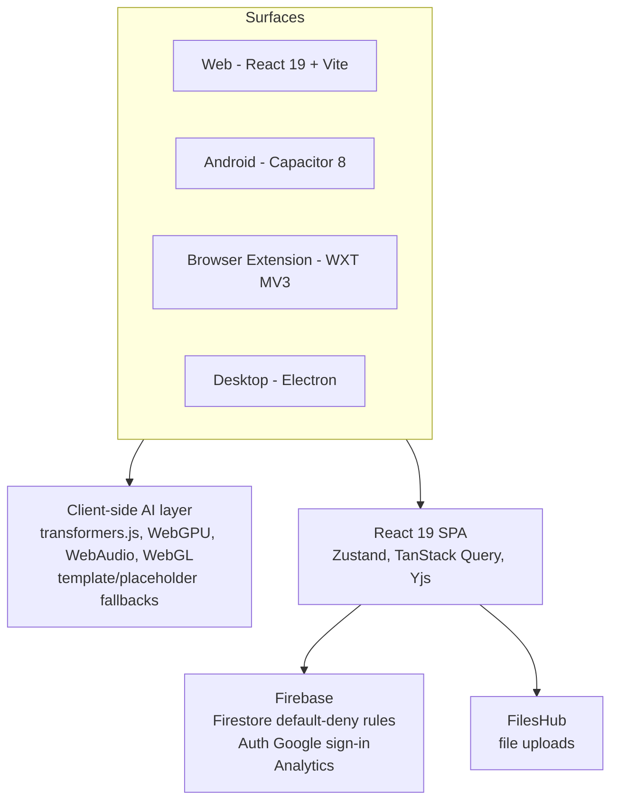

# System Architecture

The system architecture of ContentSynergy AI is the arrangement of layers that lets the app run AI in the browser, manage state and collaboration in a single-page app, and store data and files without any paid backend compute. Understanding it explains both how the product works and why it can be genuinely free.

At a high level, four parts work together: a client-side AI layer, a React 19 single-page application, Firebase for data and authentication, and FilesHub for file uploads. Four surfaces, the [web app](/platforms/web), the [Android app](/platforms/android), the [browser extension](/platforms/browser-extension), and the [Electron desktop app](/platforms/desktop), share one account and one data store. The design deliberately omits Firebase Cloud Functions and Firebase Storage to keep the product at [zero cost](/concepts/zero-cost-model).

## The layers

### Client-side AI layer

The AI layer runs in the browser using open-source technologies: transformers.js for running models, WebGPU for GPU-accelerated execution, and WebAudio and WebGL for related media and rendering work. When a model cannot run or is unavailable, the app falls back to template and placeholder output so a feature still produces something usable rather than failing outright. This client-side approach is the reason your prompts can stay on-device in the default flow, as covered on the [how the AI works](/ai/how-ai-works) page.

### React 19 single-page app

The interface is a React 19 SPA. It uses Zustand for state management, TanStack Query for data fetching and caching, and Yjs for collaborative editing. Yjs is what allows shared, real-time editing of content. This layer ties the AI features and the data layer together into the working application you interact with.

### Firebase for data and auth

Firebase provides the backend services that do not require custom server code. Firestore stores your data and is protected by default-deny security rules, meaning access is denied unless a rule explicitly allows it, a safe baseline for data security. Firebase Auth handles Google sign-in, and Firebase Analytics measures product usage. Notably, this uses Firebase's free tier and avoids server-side compute.

### FilesHub for uploads

File uploads go to FilesHub rather than Firebase Storage. This keeps file handling off a paid object-storage service while still letting you upload files. When you delete your account, your uploaded files are removed from FilesHub, as described on the [privacy and GDPR](/analytics/privacy-gdpr) page.

## What is deliberately absent

Two choices keep the architecture zero-cost. There are no Firebase Cloud Functions, so there is no paid server-side compute running on your behalf. And there is no Firebase Storage, with FilesHub handling uploads instead. Both omissions are intentional design decisions, not missing features, and together they let the product stay free while still offering data storage, authentication, and AI. The [zero-cost model](/concepts/zero-cost-model) page explains the reasoning in full.

## One account across four surfaces

Because all four surfaces talk to the same Firebase data store and authenticate the same user, your content is unified. Sign in on any surface and you reach the same account and the same data. To begin, follow the [installation guide](/getting-started/installation), and see the [tools overview](/tools/overview) for the features this architecture powers.

## Frequently asked questions

**Does ContentSynergy AI use Firebase Cloud Functions?**
No. The architecture deliberately omits Cloud Functions, so there is no paid server-side compute. This is part of keeping the product zero-cost.

**Where are files stored if not Firebase Storage?**
Files are uploaded to FilesHub instead of Firebase Storage. This avoids a paid object-storage backend while still supporting uploads.

**How is my data protected in Firestore?**
Firestore uses default-deny security rules, meaning access is denied unless a rule explicitly grants it, a safe baseline that limits unintended access.

**What runs the AI?**
A client-side AI layer using transformers.js, WebGPU, WebAudio, and WebGL, with template and placeholder fallbacks when a model is unavailable. See [how the AI works](/ai/how-ai-works).

**How do the four surfaces stay in sync?**
The web, Android, browser-extension, and desktop surfaces share one account and one Firebase data store, so signing in anywhere gives you the same content.
